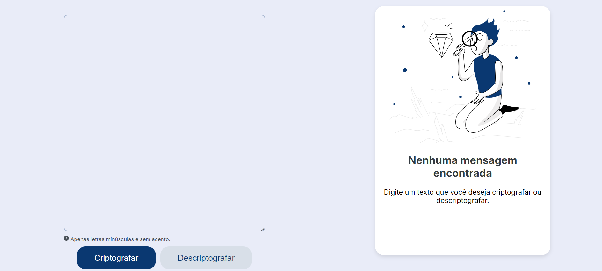
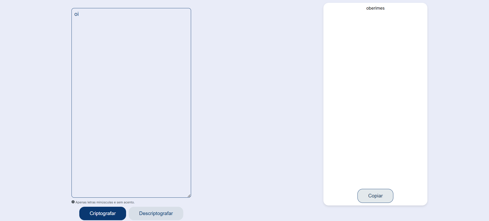

<h1 align="center"> Decodificador de texto</h1>

Bem-vindo ao projeto Decodificador! Este projeto foi criado para decodificar mensagens de forma simples e eficaz. Com uma interface intuitiva, ele permite que o usuário codifique e decodifique textos de maneira rápida.

## 🚀 Tecnologias

Esse projeto foi desenvolvido com as seguintes tecnologias:

- HTML e CSS
- JavaScript
- Git e Github
- Figma
  

## 💻 Projeto

- [Acesse o projeto finalizado, online](https://maiarakothe.github.io/decodificador/)
